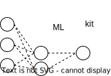

<div align="center">


# A quick way to start with machine and deep learning
[](https://www.python.org/downloads)

[](https://black.readthedocs.io/en/stable/)
[](https://pycqa.github.io/isort/) 
[](https://github.com/pylint-dev/pylint)
[](http://mypy-lang.org/)
[](http://www.pydocstyle.org/en/stable/)

[](https://github.com/opengeokube/ml-kit/blob/main/LICENSE)

[](https://github.com/opengeokube/ml-kit/actions/workflows/test.yml/)
</div>

## 🖋️ Authors
OpenGeokube Developers:
1. Jakub Walczak <a href="https://orcid.org/0000-0002-5632-9484"></a>
1. Marco Macini <a href="https://orcid.org/0000-0002-9150-943X"></a>
1. Mirko Stojiljkovic <a href="https://orcid.org/0000-0003-2256-1645"></a>
1. Shahbaz Alvi <a href="https://orcid.org/0000-0001-5779-8568"></a>

## 🎬 Quickstart

### Getting started

#### Installation
```bash
pip install mlkit
```

or

```bash
conda install ...
```

For contributing:
 
```text
git clone https://github.com/opengeokube/ml-kit
cd ml-kit
conda env create -f dev-env.yaml
pip install .
```

#### Preparing simple project
To start the new project in the current working directory, just run the following command:

```bash
mlkit init --name=my-new-project
```

It will create a directory with the name `my-new-project` where you'll find sample files.
Implement necessery methods for datamodule (`dataset.py`) and network (`model.py`).
Then, adjust `conf.toml` according to your needs. 
That's all 🎉

#### Running the training
To run the training just type the following command:

```bash
mlkit train
```

If the `conf.toml` file is present in your current working directory, the training will start.

If you need to specify the path to the configuration file, use `--conf` argument:
```bash
mlkit train --conf=/path/to/your/conf.toml
```

#### Serving the model


## 🚧 Roadmap
- [ ] add handling sklearn-like models
- [ ] add functionality to serve the model
- [ ] write more unit tests


## 📜 Cite Us
```bibtex
@ONLINE{ml-kit,
  author = {Walczak, J., Mancini, M., Stojiljkovic, M., Alvi, S.},
  title = {{MLKit}: A quick way to start with machine and deep learning},
  year = 2023,
  url = {https://github.com/opengeokube/ml-kit},
  urldate = {<access date here>}
}
```
